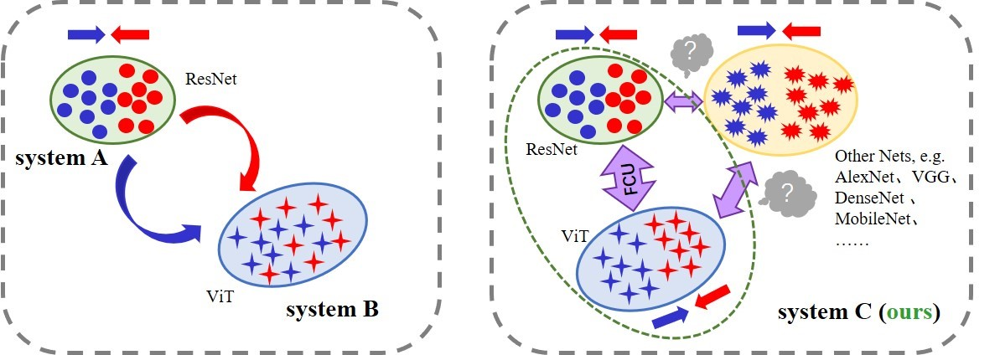
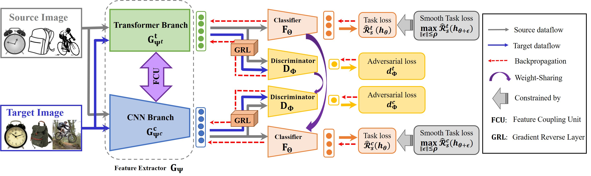
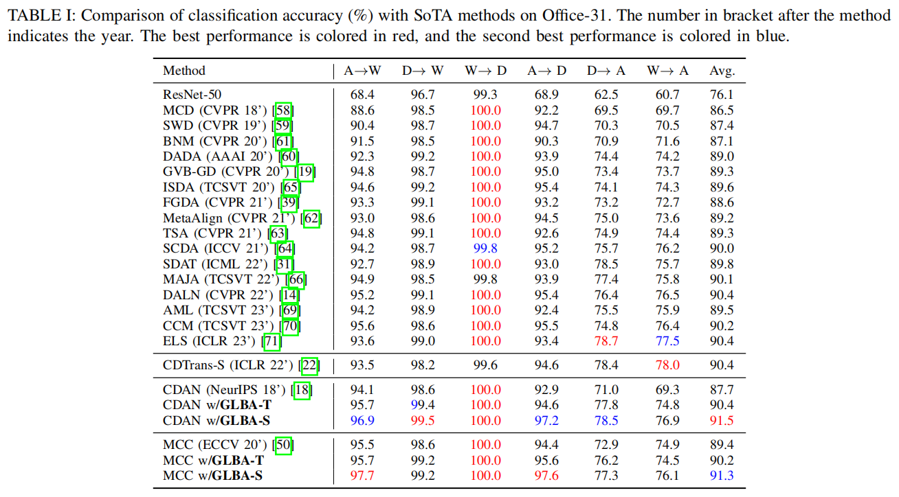

# Official implementation for **GLBA**

## [**Global-local Bi-alignment for Purer Unsupervised Domain Adaptation**]

### Existing Problem (Single-space UDA):  

### Our framework (Global-local Bi-alignment):  

Abstract—Unsupervised Domain Adaptation (UDA) aims to extract domain-invariant features. Existing UDA methods are mainly built on convolutional neural network (CNN) or vision transformer (ViT), and since they both utilize only one feature extractor, i.e., alignment in the latent space that characterizes one view of the object, matching errors will inevitably occur: distributions that have been aligned in the CNN space may remain confused in the other ViT space. To address this challenge, we attempts to follow a space-independent assumption: if the
distributions of two domains are identical, then their distributions in any latent space are aligned. Specifically, we present GlobalLocal Bi-Alignment (GLBA), a straightforward yet effective
framework based on the hybrid structure Conformer, which enforces simultaneous alignment in both spaces, yielding purer and more effective domain-invariant features. GLBA requires feature extractors capable of capturing diverse perspectives as alignment implementation spaces, while sharing parameters with extractors used as carriers for domain-invariant features. We find that the hybrid structure Conformer not only inherits the structural advantages of CNN and ViT, but also the feature coupling unit (FCU) provides connectivity to the dual space. The framework can be easily combined with previous UDA approaches, essentially adding only one alignment loss without the need for elaborate structures and large number of parameters. Extensive experiments conducted on four benchmark datasets validate the effectiveness of GLBA, which significantly improves on existing UDA methods and achieves the state-of-the-art with comparable parameter complexity.

### Results:  

